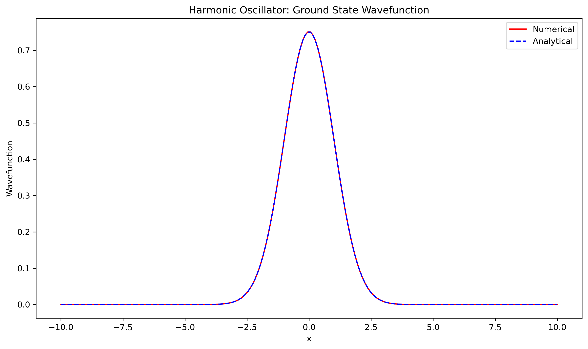
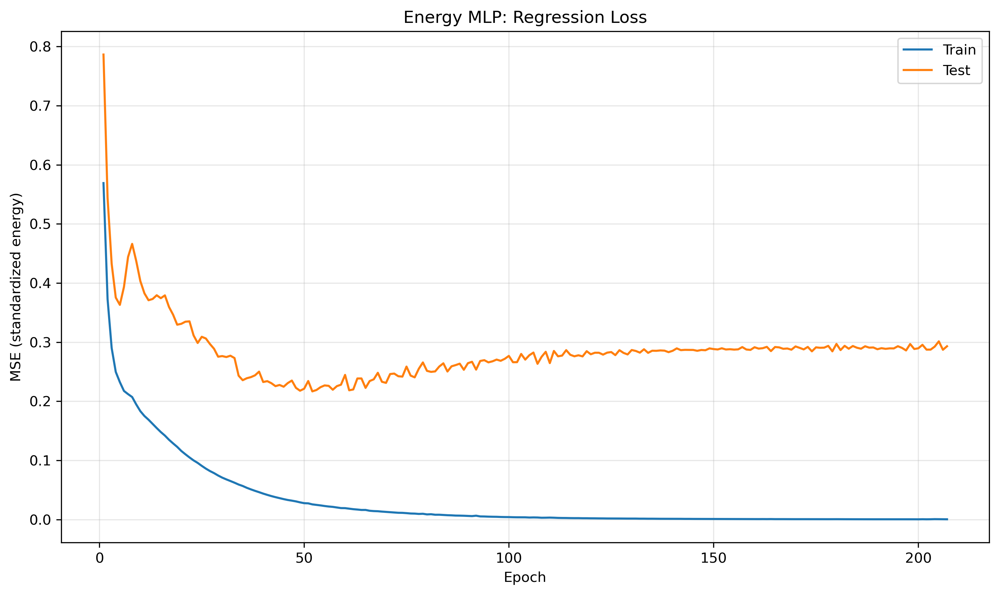
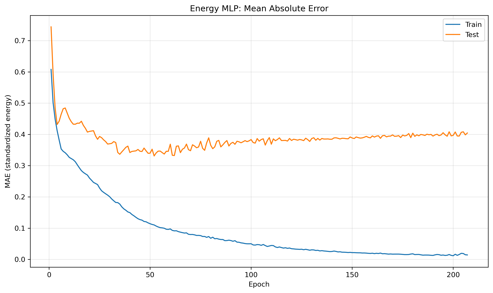
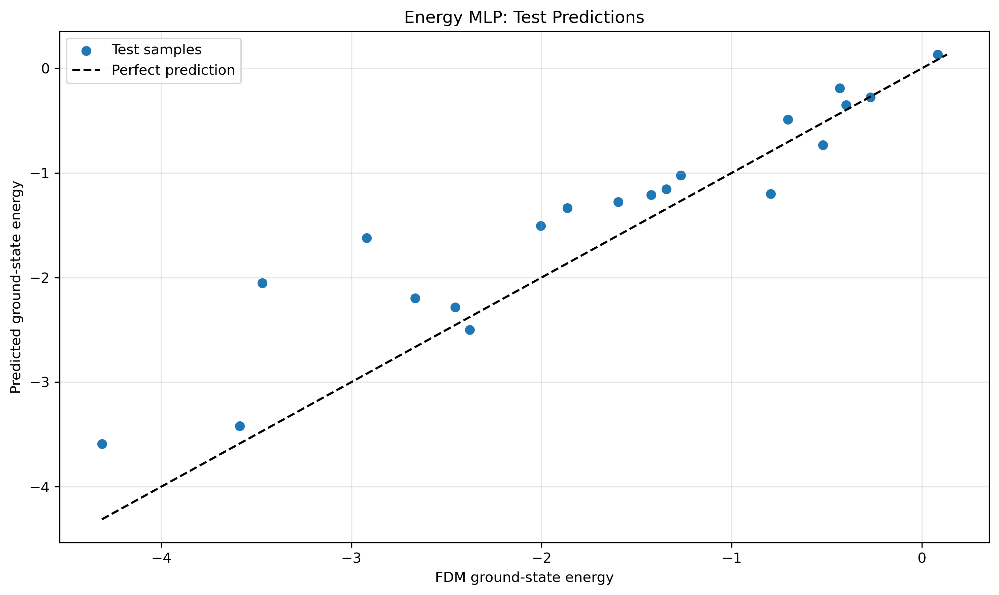
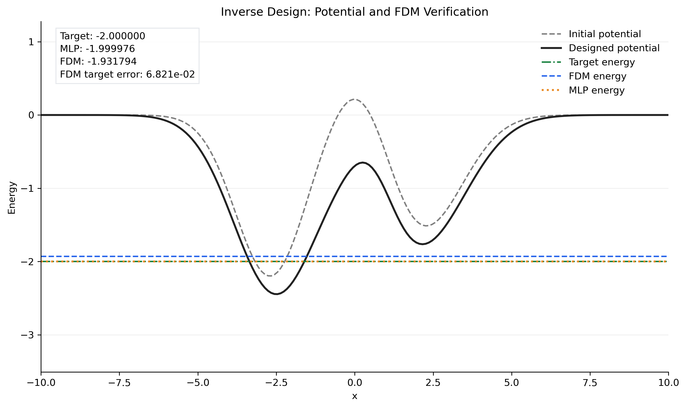

# Finite-Difference Quantum Inverse Design

A learning-oriented project combining one-dimensional quantum mechanics,
finite-difference methods, and a small neural-network surrogate.

The goal is to find a potential with a requested ground-state energy:

```text
Potential → FDM solver → Dataset → MLP surrogate
                                      ↓
Target energy → Potential optimization → FDM verification
```

The implementation favors readable scripts and explicit physical assumptions.
It does not claim accurate predictions for arbitrary potential curves or a
speed advantage over direct FDM optimization.

**Explore:** [Physical model](#physical-model) · [Installation](#installation) ·
[Workflow](#run-the-workflow) · [Tests](#solver-examples-and-tests)

## Physical model

The solver discretizes the stationary Schrodinger equation:

$$
\left[-\frac{\hbar^2}{2m}\frac{d^2}{dx^2}+V(x)\right]\psi(x)=E\psi(x).
$$

It uses a uniform grid, a second-order central difference stencil, and a dense
NumPy eigensolver. Both grid endpoints have zero Dirichlet values. Each returned
wavefunction is normalized so that

$$
\sum_i |\psi(x_i)|^2\Delta x=1.
$$

For an infinite square well, zero endpoints represent physical walls. For
infinite-domain bound states, they approximate distant decaying tails by a finite
computational domain. The solver returns all discrete finite-domain eigenstates;
identifying physical bound states is the caller's responsibility.



*Example solver check: the numerical harmonic-oscillator ground state closely
overlaps the analytical wavefunction at the plotted scale.*

## Installation

Use a Python environment with NumPy, Matplotlib, and PyTorch. From the project
root, install the dependencies:

```bash
python -m pip install -r requirement.txt
```

For an NVIDIA GPU, use a PyTorch build compatible with your system's CUDA
environment. The scripts choose CUDA when `torch.cuda.is_available()` is true,
otherwise CPU; they do not select Apple MPS.

Dependencies are deliberately unpinned: the repository does not yet include a
verified environment lock file. PyTorch must support `torch.load(...,
weights_only=True)`. Record your working package versions when sharing results.
No SciPy dependency is required.

## Files

| File | Purpose |
| --- | --- |
| `finite_difference_solver.py` | Reusable FDM solver with zero endpoint values. |
| `finite-difference_infinite_square_well.py` | Infinite well with analytical comparisons. |
| `finite-difference_harmonic_oscilator.py` | Harmonic oscillator with analytical comparisons. |
| `finite-difference_finite_square_well.py` | Finite well with boundary-matching reference calculations. |
| `finite-difference_double_square_well.py` | Double-well states, parity, and energy splitting. |
| `test_finite_difference_solver.py` | Solver regression and physical consistency tests. |
| `generate_dataset.py` | Gaussian potential function, data generator, and PyTorch Dataset. |
| `create_dataset.py` | Generate and save training and test archives. |
| `energy_mlp.py` | MLP architecture. |
| `train_energy_mlp.py` | Training, validation, test evaluation, and checkpoint saving. |
| `predict_energy.py` | Prediction for a new potential, checked against FDM. |
| `inverse_design.py` | Bounded potential optimization with final FDM verification. |

The existing spelling of `finite-difference_harmonic_oscilator.py` is retained.
Settings are edited directly in each script; there is no command-line argument
parser.

## Run the workflow

Run the following commands from the project root, in order. They execute the
calculations and write outputs; training, prediction, and inverse design also
open Matplotlib figures.

### 1. Generate data

```bash
python create_dataset.py
```

Each potential is a sum of Gaussian components:

$$
V(x)=\sum_{j=1}^{K} A_j\exp\left[-\frac{(x-c_j)^2}{2\sigma_j^2}\right].
$$

Negative amplitudes create attractive wells and positive amplitudes create
barriers. The current defaults are:

| Setting | Value |
| --- | --- |
| Samples | 100 |
| Grid | 200 points on `[-10, 10]` |
| Mass and reduced Planck constant | `m = hbar = 1` |
| Gaussian components | `K = 3` |
| Amplitude range | `[-3, 2]` |
| Center range | `[-4, 4]` |
| Width range | `[0.7, 1.5]` |
| Random seed | 42 |
| Training/test file split | 80% / 20% |

The output files are `data/train_dataset.npz` and `data/test_dataset.npz`.
Each contains:

- `X`: potential arrays with shape `(num_samples, N)`.
- `y`: FDM ground-state energies with shape `(num_samples,)`.
- `x`, `mass`, `hbar`, `boundary_condition`: shared physical settings.

Labels are the lowest energies of the finite-domain problem. Samples are not
filtered to ensure infinite-domain binding. The earlier root-level
`quantum_dataset.npz`, if present, is not read by the current training script.

### 2. Train the surrogate

```bash
python train_energy_mlp.py
```

The network is:

```text
N → Linear(32) → Tanh → Linear(16) → Tanh → Linear(1)
```

The output layer is linear. With `N = 200`, the model has 6,977 trainable
parameters. `QuantumDataset` returns float32 inputs of shape `(N,)` and targets
of shape `(1,)`.

The training file is further split into 80% training and 20% validation. With
the default 100 total samples, this gives 64 training, 16 validation, and 20
independent test samples. Normalization uses training-subset statistics only:
one shared mean and standard deviation for potential values, and a separate
pair for energies. Individual curves are not normalized independently.

Training uses Adam, learning rate `0.001`, weight decay `1e-4`, batch size `16`,
and at most `1000` epochs. Early stopping waits `100` epochs without validation
MSE improvement. The best validation weights are restored for final evaluation.

Test MSE and MAE are recorded each epoch for visualization, but do not control
weight updates or early stopping. Do not use these test curves to tune settings;
otherwise a fresh held-out set is needed for an independent final assessment.
Learning curves use standardized units, while final MAE and RMSE use original
energy units.

The checkpoint `model/energy_mlp.pth` includes model weights, architecture
configuration, normalization statistics, physical settings, split indices,
and metric histories. Keep the full checkpoint dictionary, not just its weights,
for use with the supplied inference scripts.

#### Example training results

The saved figures below illustrate one run, rather than guaranteed performance
for every training configuration.

| Mean squared error | Mean absolute error |
| --- | --- |
|  |  |

*Both plots use standardized energies. Training error continues to decrease
while test error eventually rises, indicating overfitting in this run. Model
selection still uses validation loss, not the displayed test curves.*



*The dashed diagonal represents exact agreement. Deviations show the remaining
surrogate error, including substantial errors for some test potentials.*

### 3. Predict a new potential

```bash
python predict_energy.py
```

Edit `A`, `c`, and `sigma` in the script. The grid and physical parameters are
loaded from the checkpoint. The script reports MLP and FDM energies and their
absolute difference, then plots the potential and both energy estimates.

If training was performed on another computer, copy its checkpoint to
`model/energy_mlp.pth` first. A GPU-trained checkpoint can be loaded on CPU.

### 4. Perform inverse design

```bash
python inverse_design.py
```

Set `E_target` and the initial Gaussian parameters in the script. The default
target is `-2.0`. Model weights stay frozen while Adam updates `A`, `c`, and
`sigma` through a differentiable PyTorch potential function, minimizing

$$
\mathcal{L}=(E_{\mathrm{MLP}}-E_{\mathrm{target}})^2.
$$

Parameters are projected back into their allowed ranges after each step. The
default run permits 2,000 updates at learning rate `0.01`, stopping early if
the predicted absolute target error reaches `1e-4`.

The candidate with the lowest surrogate loss is independently evaluated by FDM.
The saved `success` flag requires an FDM target error no larger than `0.01`.
A small surrogate loss alone does not certify a successful design. The result,
including parameters, potentials, energies, and optimization history, is saved
as `data/inverse_design_result.npz`.

Sampling bounds are not stored in the model checkpoint. If you change the
training distribution or number of Gaussian components, update the inverse
design bounds and initial parameters accordingly. One target can have multiple
solutions; this single-start optimization does not guarantee a solution or a
global optimum.

#### Example candidate and physical verification



The annotations in this saved figure report:

| Quantity | Value |
| --- | ---: |
| Target energy | -2.000000 |
| MLP prediction | -1.999976 |
| FDM verification | -1.931794 |
| Absolute FDM target error | Approximately 0.06821 |

The surrogate nearly reaches the target, but the FDM error exceeds the default
`0.01` tolerance. **This candidate does not pass the physical verification
criterion.** It demonstrates why surrogate optimization must be followed by an
independent FDM calculation.

## Solver examples and tests

```bash
python finite-difference_infinite_square_well.py
python finite-difference_harmonic_oscilator.py
python finite-difference_finite_square_well.py
python finite-difference_double_square_well.py
python -m unittest test_finite_difference_solver.py
```

The tests cover normalization, square-well energy convergence, oscillator
reference values, energy shifts, mass/Planck-constant scaling, double-well
symmetry, and invalid inputs. They are not an exhaustive convergence study for
all generated potentials.

To use the solver directly:

```python
import numpy as np
from finite_difference_solver import solve_schrodinger

x = np.linspace(-10, 10, 200)
V = 0.5 * x**2
energies, wavefunctions = solve_schrodinger(x, V, mass=1.0, hbar=1.0)
E0 = energies[0]
psi0 = wavefunctions[:, 0]
```

## Outputs and limitations

Generated datasets and inverse-design results go to `data/`, checkpoints to
`model/`, and 300 dpi PNG figures to `figure/`. Scripts create these directories
when needed, relative to the script location. Repeated runs overwrite matching
output filenames.

README figures use relative paths into `figure/`. Include the referenced PNG
files when publishing the repository so they render on GitHub. If you replace
the figures with a new run, update the accompanying descriptions and reported
values as well.

The default 100-sample dataset is intended to exercise the workflow, not to
establish broad predictive accuracy. The model is restricted to its training
distribution, grid, physical parameters, and boundary conditions. Smooth sums
of three Gaussians do not cover arbitrary potentials or sharp discontinuities.

The solver uses a dense matrix and computes all eigenstates, so large grids and
large datasets can be expensive. No surrogate speedup has been established.
Full grid and domain convergence studies remain future work. This repository
provides a first implementation; reproducible quantitative performance and
inverse-design success must be evaluated in the environment used for the run.
